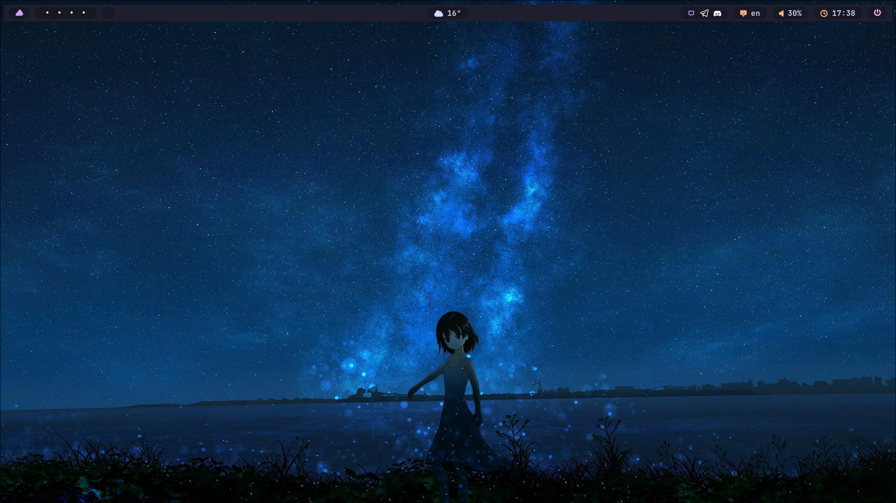
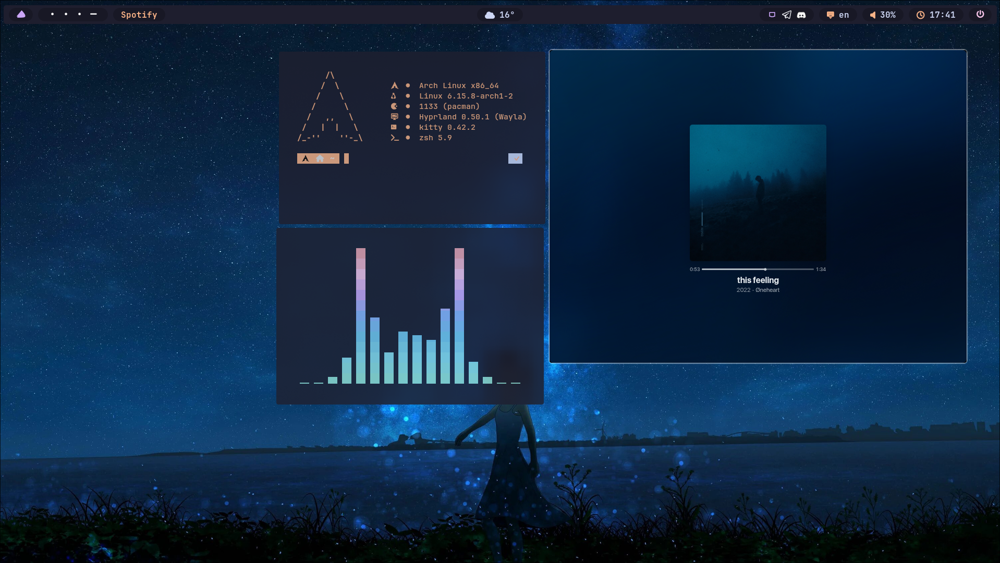
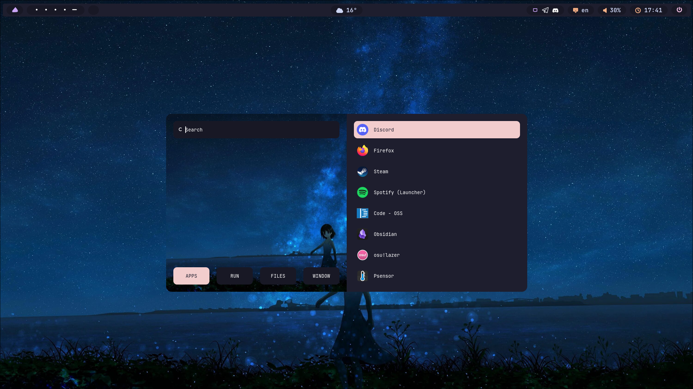

# 🖼️ Screenshots

  
  

---

# 🛠️ Info

| Component       | Description             |
|-----------------|-------------------------|
| **DISTRO**      | Arch                    |
| **WM**          | Hyprland                |
| **BAR**         | Waybar                  |
| **LAUNCHER**    | Rofi                    |
| **TERMINAL**    | Kitty                   |
| **SHELL**       | Zsh                     |
| **NOTIFICATION**| Mako                    |

---

# 🎨 Themes & Icons

- **Cursor:** Catppuccin Mocha Dark  
- **GTK Theme:** Catppuccin-Dark-Macchiato  
- **Icons:** Catppuccin-Mocha

---

## P.S
I tried to compress these dot files as much as possible, as this is my first rice or config, there may be errors or bugs. you can find my contact in the git hub profile.
There may be a question: why is the endeavourOS icon on the waybar and not the linux arch. I decided that it would fit better with this kofnig, and it's beautiful, I don't like the arch-linux icon too much
