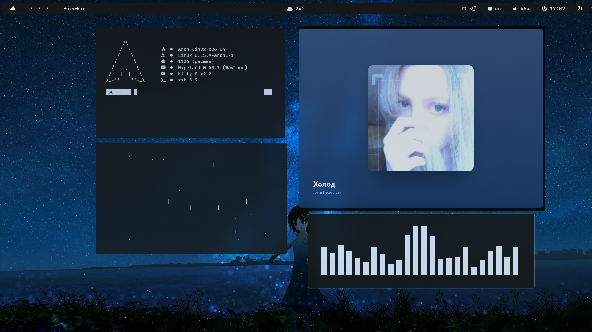

# 🖼️ Screenshots


  
  


---

# 🛠️ Info

| Component       | Description             |
|-----------------|-------------------------|
| **DISTRO**      | Arch                    |
| **WM**          | Hyprland                |
| **BAR**         | Waybar                  |
| **LAUNCHER**    | Rofi                    |
| **TERMINAL**    | Kitty                   |
| **SHELL**       | Zsh                     |
| **NOTIFICATION**| Mako                    |

---
# Dependency
1
```
sudo pacman -Syu
```
2
```
sudo pacman -S zsh hyprland hyprshot grim kitty swww fastfetch grim slurp cava imagemagick w3m awesome-terminal-fonts otf-font-awesome ttf-font-awesome ttf-jetbrains-mono ttf-jetbrains-mono-nerd nerd-fonts waybar iniparser rofi-wayland git swappy thunar
```
3
```
git clone https://aur.archlinux.org/yay.git
cd yay
makepkg -si
```
4
```
git clone --depth=1 https://github.com/adi1090x/rofi.git
cd rofi
chmod +x setup.sh
./setup.sh
```
5
```
git clone https://github.com/ohmyzsh/ohmyzsh
git clone https://gist.github.com/n1snt/454b879b8f0b7995740ae04c5fb5b7df
git clone https://github.com/romkatv/powerlevel10k
```
6
```
cd ~/.config/rofi
chmod +x powermenu.sh
```
---
---

# 🎨 Themes & Icons

- **Cursor:** Catppuccin Mocha Dark  
- **GTK Theme:** Catppuccin-Dark-Macchiato  
- **Icons:** Catppuccin-Mocha

---

## P.S
I tried to compress these dot files as much as possible, as this is my first rice or config, there may be errors or bugs. you can find my contact in the git hub profile.
There may be a question: why is the endeavourOS icon on the waybar and not the linux arch. I decided that it would fit better with this config, and it's beautiful, I don't like the arch-linux icon too much
