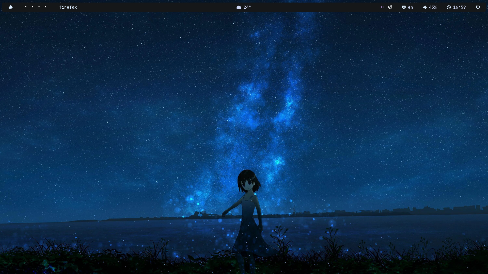

# 🖼️ Screenshots

  
  

---

# 🛠️ Info

| Component       | Description             |
|-----------------|-------------------------|
| **DISTRO**      | Arch                    |
| **WM**          | Hyprland                |
| **BAR**         | Waybar                  |
| **LAUNCHER**    | Rofi                    |
| **TERMINAL**    | Kitty                   |
| **SHELL**       | Zsh                     |
| **NOTIFICATION**| Mako                    |
| **LOCKING**     | Hyprlock                |

---

# 🎨 Themes & Icons

- **Cursor:** Catppuccin Mocha Dark  
- **GTK Theme:** Catppuccin-Dark-Macchiato  
- **Icons:** Catppuccin-Mocha

---

## P.S
I tried to compress these dot files as much as possible, as this is my first rice or config, there may be errors or bugs. you can find my contact in the git hub profile.
